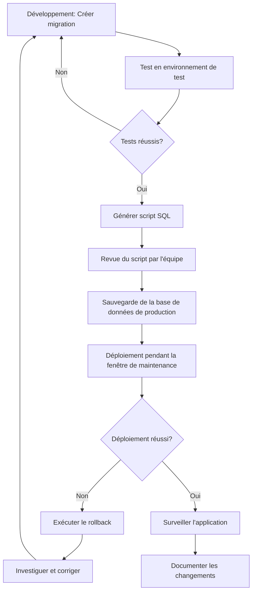

# 10.4. Migrations

🔝 Retour au [Sommaire](/SOMMAIRE.md)

Les migrations sont l'un des outils les plus puissants d'Entity Framework Core. Elles vous permettent de faire évoluer votre base de données de manière contrôlée, en synchronisation avec les changements de votre modèle d'entités. Considérez les migrations comme un système de contrôle de version pour votre schéma de base de données.

## 10.4.1. Création de migrations

Les migrations représentent les changements à appliquer à votre base de données pour qu'elle corresponde à votre modèle actuel. Voyons comment les créer et les utiliser.

### Prérequis : outils de ligne de commande

Avant de commencer, assurez-vous d'avoir installé les outils nécessaires :

**Via la Console du Gestionnaire de Packages (Visual Studio)** :
```
Install-Package Microsoft.EntityFrameworkCore.Tools
```

**Via la CLI .NET** :
```
dotnet tool install --global dotnet-ef
dotnet add package Microsoft.EntityFrameworkCore.Design
```

### Création de votre première migration

Après avoir défini vos classes d'entités et votre `DbContext`, vous pouvez créer votre première migration :

**Via la Console du Gestionnaire de Packages** :
```
Add-Migration InitialCreate
```

**Via la CLI .NET** :
```
dotnet ef migrations add InitialCreate
```

> **Conseil pour débutants** : Donnez toujours des noms descriptifs à vos migrations. "InitialCreate" est approprié pour la première migration, mais utilisez des noms comme "AjoutTableClients" ou "ModificationColonneEmail" pour les migrations suivantes.

### Que contient une migration ?

Une migration crée généralement trois fichiers dans le dossier `Migrations` de votre projet :

1. **[Horodatage]_[NomMigration].cs** : La classe principale de migration qui contient les méthodes `Up()` (pour appliquer) et `Down()` (pour annuler)

   ```csharp
   public partial class InitialCreate : Migration
   {
       protected override void Up(MigrationBuilder migrationBuilder)
       {
           migrationBuilder.CreateTable(
               name: "Clients",
               columns: table => new
               {
                   Id = table.Column<int>(nullable: false)
                       .Annotation("SqlServer:Identity", "1, 1"),
                   Nom = table.Column<string>(maxLength: 100, nullable: false),
                   Email = table.Column<string>(maxLength: 150, nullable: true)
               },
               constraints: table =>
               {
                   table.PrimaryKey("PK_Clients", x => x.Id);
               });
       }

       protected override void Down(MigrationBuilder migrationBuilder)
       {
           migrationBuilder.DropTable(
               name: "Clients");
       }
   }
   ```

2. **[Horodatage]_[NomMigration].Designer.cs** : Contient des métadonnées sur la migration

3. **[ContextName]ModelSnapshot.cs** : Représente l'état actuel complet du modèle

### Création de migrations pour des modifications ultérieures

Lorsque vous modifiez vos classes d'entités ou votre configuration, vous devez créer une nouvelle migration pour refléter ces changements :

```csharp
// Ajout d'une nouvelle propriété à l'entité Client
public class Client
{
    public int Id { get; set; }
    public string Nom { get; set; }
    public string Email { get; set; }
    public string Telephone { get; set; } // Nouvelle propriété
}
```

Puis créez une migration pour cette modification :

```
Add-Migration AjoutTelephoneClient
```

EF Core détectera automatiquement la différence et générera le code SQL nécessaire pour ajouter la colonne dans votre base de données.

### Visualisation du SQL généré

Vous pouvez prévisualiser le SQL qui sera exécuté sans l'appliquer :

**Via la Console du Gestionnaire de Packages** :
```
Script-Migration
```

**Via la CLI .NET** :
```
dotnet ef migrations script
```

Pour générer un script entre deux migrations spécifiques :
```
Script-Migration PremiereMigration DerniereMigration
```

## 10.4.2. Application de migrations

Une fois vos migrations créées, vous devez les appliquer à votre base de données.

### Application via les outils de ligne de commande

**Via la Console du Gestionnaire de Packages** :
```
Update-Database
```

**Via la CLI .NET** :
```
dotnet ef database update
```

### Application à une migration spécifique

Vous pouvez mettre à jour la base de données à une migration spécifique :

```
Update-Database NomOuHorodatageDeLaMigration
```

Par exemple :
```
Update-Database InitialCreate
```

Cela appliquera toutes les migrations jusqu'à "InitialCreate" incluse.

### Revenir à une migration précédente

Vous pouvez également revenir en arrière à une migration précédente :

```
Update-Database NomDUneMigrationAnterieure
```

Si vous voulez revenir à l'état avant toute migration :

```
Update-Database 0
```

### Application programmatique des migrations

Dans certains scénarios, vous pourriez vouloir appliquer les migrations directement dans le code :

```csharp
// Par exemple, dans Program.cs ou Startup.cs
using (var context = new AppDbContext())
{
    context.Database.Migrate();
}
```

Cette approche est utile pour les applications web où vous voulez vous assurer que la base de données est à jour au démarrage de l'application.

> **Attention** : Utilisez cette approche avec précaution en production, car vous pourriez déclencher des migrations pendant les heures de pointe.

## 10.4.3. Personnalisation de migrations

Parfois, la migration générée automatiquement ne répond pas exactement à vos besoins. Heureusement, vous pouvez personnaliser vos migrations.

### Édition manuelle du code de migration

Vous pouvez modifier directement le code généré dans le fichier de migration. Par exemple, vous pourriez vouloir :

- Ajouter des données initiales (seed)
- Modifier le type d'une colonne d'une manière spécifique
- Ajouter des contraintes personnalisées

```csharp
public partial class InitialCreate : Migration
{
    protected override void Up(MigrationBuilder migrationBuilder)
    {
        // Code généré automatiquement...

        // Ajout de données initiales
        migrationBuilder.InsertData(
            table: "Categories",
            columns: new[] { "Id", "Nom" },
            values: new object[] { 1, "Électronique" });

        migrationBuilder.InsertData(
            table: "Categories",
            columns: new[] { "Id", "Nom" },
            values: new object[] { 2, "Livres" });
    }

    protected override void Down(MigrationBuilder migrationBuilder)
    {
        // Code généré automatiquement...

        // Suppression des données initiales
        migrationBuilder.DeleteData(
            table: "Categories",
            keyColumn: "Id",
            keyValue: 1);

        migrationBuilder.DeleteData(
            table: "Categories",
            keyColumn: "Id",
            keyValue: 2);
    }
}
```

### Utilisation des opérations SQL brutes

Vous pouvez également exécuter du SQL brut dans vos migrations :

```csharp
protected override void Up(MigrationBuilder migrationBuilder)
{
    // Code généré automatiquement...

    // Exécution de SQL personnalisé
    migrationBuilder.Sql(@"
        CREATE PROCEDURE sp_GetClientsParVille
            @Ville NVARCHAR(100)
        AS
        BEGIN
            SELECT * FROM Clients WHERE Ville = @Ville
        END
    ");
}

protected override void Down(MigrationBuilder migrationBuilder)
{
    // Code généré automatiquement...

    // Suppression de la procédure stockée
    migrationBuilder.Sql("DROP PROCEDURE sp_GetClientsParVille");
}
```

### Migrations vides pour personnalisation complète

Vous pouvez créer une migration vide et la remplir entièrement à la main :

```
Add-Migration CreationProceduresStockees -SkipModel
```

Cela crée une migration vide que vous pouvez remplir avec votre propre logique.

### Initialisation de données avec HasData

Une alternative à la personnalisation directe des migrations est d'utiliser la méthode `HasData` dans la configuration du modèle :

```csharp
protected override void OnModelCreating(ModelBuilder modelBuilder)
{
    modelBuilder.Entity<Categorie>().HasData(
        new Categorie { Id = 1, Nom = "Électronique" },
        new Categorie { Id = 2, Nom = "Livres" }
    );
}
```

Lorsque vous créez une migration, EF Core générera automatiquement le code pour insérer ces données.

> **Important** : Avec `HasData`, vous devez spécifier explicitement les valeurs de clé primaire.

## 10.4.4. Stratégies de migration en production

La gestion des migrations en environnement de production nécessite une planification et une attention particulières.

### Génération de scripts SQL

Pour les déploiements en production, il est souvent préférable de générer un script SQL à partir de vos migrations plutôt que de les appliquer directement :

```
Script-Migration -From MigrationPrecedente -To MigrationCible
```

Vous pouvez ensuite :
- Réviser le script pour vous assurer qu'il est sûr
- Exécuter le script pendant une fenêtre de maintenance
- Conserver le script comme documentation des changements

### Sauvegarde avant migration

Toujours effectuer une sauvegarde de la base de données avant d'appliquer des migrations en production :

```sql
BACKUP DATABASE [NomDeLaBase] TO DISK = 'C:\Backups\NomDeLaBase_PreMigration.bak'
```

### Stratégies selon le type d'application

#### Applications avec déploiement continu
- Utilisez des migrations incrémentales petites et fréquentes
- Testez chaque migration dans un environnement similaire à la production
- Automatisez l'application des migrations avec des outils CI/CD

```csharp
// Dans Program.cs ou Startup.cs
// Appliquer automatiquement les migrations au démarrage
// (Uniquement pour les applications avec peu d'instances)
if (env.IsDevelopment() || env.IsStaging())
{
    context.Database.Migrate();
}
```

#### Applications d'entreprise avec fenêtres de maintenance
- Générez des scripts SQL pour les DBA
- Planifiez les migrations pendant les fenêtres de maintenance
- Prévoyez des procédures de rollback

### Migration par étapes (zero-downtime)

Pour les applications critiques où le temps d'arrêt doit être minimisé :

1. **Étape 1 : Changements compatibles avec l'ancienne version**
   - Ajoutez d'abord de nouvelles tables/colonnes sans modifier les existantes
   - Déployez la migration

2. **Étape 2 : Déploiement du nouveau code**
   - Mettez à jour l'application pour utiliser les nouvelles structures

3. **Étape 3 : Nettoyage**
   - Après confirmation que tout fonctionne, supprimez les anciennes structures

### Gestion des erreurs de migration

Préparez un plan en cas d'échec de migration :

```csharp
try
{
    context.Database.Migrate();
}
catch (Exception ex)
{
    // Journaliser l'erreur
    logger.LogError(ex, "Une erreur s'est produite lors de la migration de la base de données.");

    // Notification à l'équipe
    alertService.SendAlert("Échec de migration de la base de données");

    // En développement, vous pouvez laisser l'exception se propager
    // En production, vous pourriez vouloir continuer avec un mode dégradé
    if (env.IsDevelopment())
    {
        throw;
    }
}
```

### Bonnes pratiques pour les migrations en production

1. **Ne supprimez jamais les fichiers de migration** de votre projet, même après leur application
2. **Testez toujours les migrations** dans un environnement de préproduction
3. **Évitez les migrations massives** qui modifient de nombreuses tables à la fois
4. **Planifiez une stratégie de rollback** pour chaque déploiement
5. **Documentez chaque migration** avec des commentaires dans le code
6. **Surveillez les performances** pendant l'application des migrations

### Exemple de workflow complet pour un déploiement en production



---

Les migrations sont un outil extrêmement puissant d'Entity Framework Core qui vous permet de gérer l'évolution de votre base de données de manière contrôlée. Avec une bonne compréhension et application des concepts présentés dans cette section, vous pourrez faire évoluer votre schéma de base de données en toute confiance, même dans des environnements de production critiques.

⏭️
