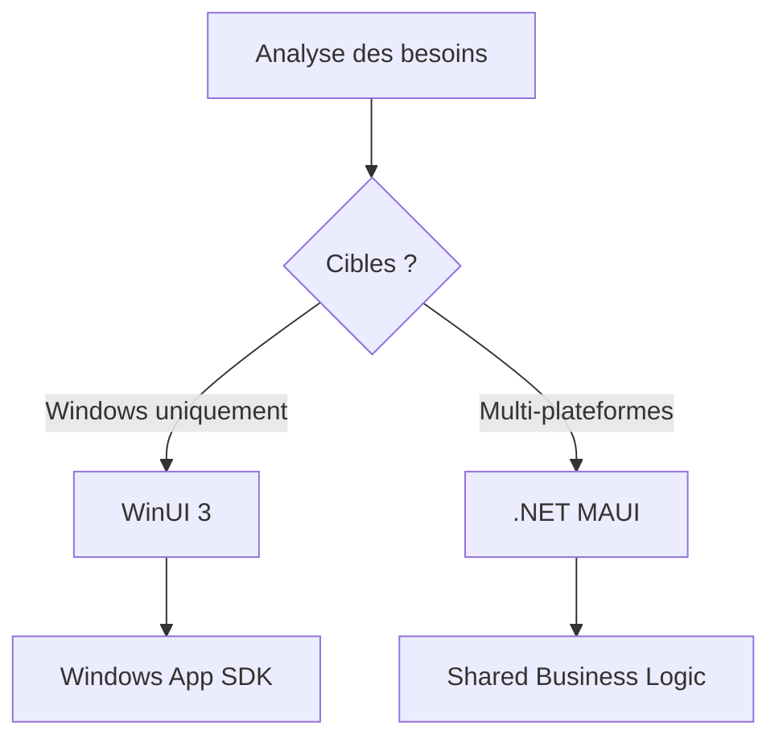

# 13. Applications de bureau modernes avec .NET

🔝 Retour au [Sommaire](/SOMMAIRE.md)


## La renaissance des applications de bureau

Les applications de bureau vivent une **véritable renaissance**. Loin de disparaître face à la montée du web et du mobile, elles se réinventent avec des technologies qui allient **performance native** et **expérience utilisateur moderne**.

> **💡 Le paradoxe moderne :**
> Alors que tout semble migrer vers le cloud, les applications de bureau retrouvent leur pertinence grâce à l'IA locale, la réalité augmentée et le besoin croissant de performances maximales.

---

## 🔄 L'évolution du paysage desktop .NET

### **L'ère classique** (2002-2020)
```
Windows Forms → Interface rapide mais limitée
WPF → Richesse graphique, complexité croissante
Windows uniquement → Écosystème fermé
```

### **La transformation moderne** (2020-2025)
```
Windows App SDK → Unification des APIs
WinUI 3 → Design Fluent natif
.NET MAUI → Multiplateforme enfin viable
MSIX → Déploiement révolutionné
```

### **L'avenir prometteur** (2025+)
```
IA intégrée → Copilot natif
Performance optimale → AOT compilation
Écosystème ouvert → Windows, macOS, Linux
```

---

## 🎯 Votre roadmap technologique

### **🏗️ Technologies fondamentales**

**Windows App SDK** - L'unificateur
- APIs Windows modernes unifiées
- Compatibilité descendante garantie
- Pont entre ancien et nouveau monde

**WinUI 3** - L'interface nouvelle génération
- Fluent Design System intégré
- Performances natives optimisées
- Séparation claire logique/présentation

**.NET MAUI** - Le multiplateforme réalisé
- Code partagé maximisé (90%+)
- UI native sur chaque plateforme
- Accès complet aux APIs spécifiques

**MSIX** - Le packaging révolutionné
- Installation propre et sécurisée
- Mises à jour delta intelligentes
- Isolation complète des applications

---

## 🛤️ Chemins de migration par contexte

### **🏢 Applications d'entreprise existantes**

**Depuis WinForms :**


**Depuis WPF :**


### **🌍 Nouvelles applications multiplateformes**

**Stratégie recommandée :**


---

## 🎨 Design moderne et expérience utilisateur

### **Fluent Design System**
**Les 5 piliers de l'excellence UI :**

1. **🌟 Light** - Éclairage dynamique et contextuel
2. **🌊 Depth** - Profondeur et hiérarchie visuelle
3. **🎭 Motion** - Animations fluides et naturelles
4. **📦 Material** - Textures et surfaces réalistes
5. **🎯 Scale** - Adaptation parfaite à tous les écrans

### **Composants modernes prêts à l'emploi**
```xml
<!-- Exemple WinUI 3 : Navigation moderne -->
<NavigationView x:Name="MainNavigation">
    <NavigationView.MenuItems>
        <NavigationViewItem Icon="Home" Content="Accueil" />
        <NavigationViewItem Icon="Document" Content="Documents" />
        <NavigationViewItem Icon="Settings" Content="Paramètres" />
    </NavigationView.MenuItems>

    <Frame x:Name="ContentFrame" />
</NavigationView>
```

---

## ⚡ Performance et optimisation

### **Avantages des technologies modernes**

| Aspect | Ancienne génération | Moderne (.NET 8) |
|--------|-------------------|-------------------|
| **Démarrage** | 2-5 secondes | 0.5-1 seconde |
| **Mémoire** | 50-200 MB | 20-80 MB |
| **Responsive** | Blocages fréquents | Fluidité garantie |
| **Rendu** | CPU intensif | GPU accéléré |

### **Techniques d'optimisation native**
```csharp
// AOT compilation pour performances maximales
<PropertyGroup>
    <PublishAot>true</PublishAot>
    <PublishTrimmed>true</PublishTrimmed>
    <TrimMode>link</TrimMode>
</PropertyGroup>
```

---

## 🔧 Écosystème d'outils modernes

### **Développement**
- **Visual Studio 2022** - IDE optimisé pour .NET 8
- **VS Code + C# Dev Kit** - Alternative légère
- **Blend for Visual Studio** - Design XAML avancé
- **WinUI 3 Gallery** - Composants et exemples

### **Packaging et déploiement**
- **MSIX Packaging Tool** - Conversion automatique
- **Azure DevOps** - CI/CD intégré
- **Microsoft Store** - Distribution simplifiée
- **Windows Package Manager** - Installation en ligne de commande

### **Monitoring et diagnostics**
- **Application Insights** - Télémétrie intégrée
- **PerfView** - Analyse de performance
- **Visual Studio Diagnostic Tools** - Débogage avancé

---

## 🎯 Cas d'usage par technologie

### **Windows App SDK + WinUI 3**
```
✅ Applications Windows premium
✅ Interface moderne requise
✅ Intégration système poussée
✅ Performance critique
❌ Besoin multiplateforme
```

**Exemples parfaits :** Outils créatifs, applications métier complexes, utilitaires système

### **.NET MAUI**
```
✅ Développement multiplateforme
✅ Interface cohérente souhaitée
✅ Équipe de développement unifiée
✅ Maintenance simplifiée
❌ Interface ultra-spécialisée par plateforme
```

**Exemples parfaits :** Applications d'entreprise, outils de productivité, apps de données

### **Migration progressive WPF**
```
✅ Applications existantes importantes
✅ Équipe expérimentée WPF
✅ Migration par étapes souhaitée
✅ Investissement préservé
❌ Refonte complète acceptée
```

---

## 🚀 Quick Start par profil

### **👨‍💼 Développeur d'entreprise**
1. **Évaluer** l'existant WinForms/WPF
2. **Migrer** vers .NET 8 (étape 1)
3. **Intégrer** Windows App SDK progressivement
4. **Moderniser** l'UI avec WinUI 3

### **🌍 Créateur multiplateforme**
1. **Commencer** avec .NET MAUI
2. **Structurer** la logique partagée
3. **Personnaliser** l'UI par plateforme
4. **Optimiser** les performances natives

### **🎨 Designer d'applications**
1. **Maîtriser** Fluent Design System
2. **Utiliser** les composants WinUI 3
3. **Prototyper** avec Blend
4. **Tester** sur différents appareils

---

## 🎪 Défis et solutions modernes

### **Défis techniques courants**
**🔄 Migration de données legacy**
- Solution : Adaptateurs et ponts progressifs
- Outils : Entity Framework migrations

**🎯 Performance sur ancien matériel**
- Solution : Profils d'exécution adaptatifs
- Outils : AOT compilation conditionnelle

**🔐 Sécurité et isolation**
- Solution : MSIX sandboxing natif
- Outils : Windows App SDK Security APIs

### **Stratégies de réussite**
1. **Commencer petit** - Proof of concept ciblé
2. **Mesurer constamment** - Métriques de performance
3. **Former l'équipe** - Montée en compétences progressive
4. **Itérer rapidement** - Feedback utilisateur continu

---

## 🎖️ L'excellence en action

**Les applications de bureau modernes excellent quand elles :**
- **Démarrent instantanément** (< 1 seconde)
- **Répondent immédiatement** à chaque interaction
- **S'intègrent naturellement** à l'OS
- **Se mettent à jour transparemment**
- **Protègent les données** par conception

---

## 🚀 Votre prochaine étape

Les applications de bureau n'ont jamais été aussi **puissantes et accessibles** à développer. Les technologies modernes .NET offrent le meilleur des deux mondes : **performance native** et **productivité de développement**.

**Prêt à créer la prochaine génération d'applications desktop ?**

⏭️ Commençons par **13.1. [Windows App SDK](/13-applications-de-bureau-modernes-avec-dotnet/13-1-windows-app-sdk-anciennement-project-reunion.md)** - votre porte d'entrée vers les APIs Windows modernes.
