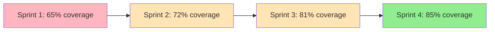

# 15. Tests et qualité de code

🔝 Retour au [Sommaire](/SOMMAIRE.md)


## L'art de créer du code qui dure

La qualité logicielle ne se mesure pas uniquement à l'absence de bugs, mais à la **capacité d'un code à évoluer sereinement** dans le temps. Ce chapitre vous révèle les secrets pour créer des applications .NET robustes, maintenables et évolutives grâce aux tests automatisés et aux outils d'analyse modernes.

> **💡 La règle d'or du développement :**
> "Un code sans test est un code legacy dès sa création. Un code bien testé est un investissement qui rapporte pendant des années."

---

## 🎯 Pourquoi la qualité est-elle critique ?

### **📊 Impact économique concret**
```
Code de haute qualité vs Code négligé :
├── Temps de développement nouvelles features : -60%
├── Coût de maintenance annuel : -75%
├── Nombre de bugs en production : -90%
└── Satisfaction équipe développement : +200%
```

### **🚀 Bénéfices tangibles**
- **Déploiements sans stress** grâce à la confiance dans le code
- **Refactoring serein** avec filet de sécurité automatisé
- **Onboarding rapide** des nouveaux développeurs
- **Documentation vivante** via les tests comme spécifications

---

## 🔄 L'évolution des pratiques .NET

### **L'ancien monde** (.NET Framework)
```
Tests manuels fastidieux
Outils dispersés et complexes
Culture "ça marche sur ma machine"
Debugging réactif exclusivement
```

### **Le nouveau paradigme** (.NET 8)
```
Testing ultra-simplifié (dotnet test)
Tooling intégré et performant
CI/CD avec quality gates automatiques
Observabilité et prévention des problèmes
```

---

## 🏗️ Votre arsenal qualité complet

### **🎯 Tests : Votre filet de sécurité**

**Tests unitaires** - La base solide
- **xUnit** : Le standard moderne et élégant
- **MSTest** : L'intégration Microsoft native
- **NUnit** : La flexibilité maximale
- **Moq** : Isolation parfaite des dépendances

**Tests d'intégration** - La validation réaliste
- **TestServer** : APIs testées en conditions réelles
- **Docker Test Containers** : Dépendances isolées
- **Entity Framework InMemory** : Bases de données virtuelles
- **Playwright** : UI automatisée cross-browser

### **🔍 Analyse statique : Votre radar à problèmes**

**Analyseurs intégrés** - Détection en temps réel
- **Roslyn Analyzers** : Règles métier personnalisées
- **StyleCop** : Cohérence stylistique automatique
- **Code Coverage** : Zones non testées identifiées
- **Security Analyzers** : Vulnérabilités prévenues

**Outils professionnels** - Excellence technique
- **SonarQube** : Analyse continue multi-langages
- **NDepend** : Architecture et dépendances visualisées
- **ReSharper/Rider** : Productivité et qualité augmentées

---

## 🎪 Framework de tests : Le grand comparatif

| Critère | xUnit | MSTest | NUnit |
|---------|-------|--------|-------|
| **Modernité** | ⭐⭐⭐⭐⭐ | ⭐⭐⭐⭐ | ⭐⭐⭐ |
| **Performance** | ⭐⭐⭐⭐⭐ | ⭐⭐⭐ | ⭐⭐⭐⭐ |
| **Simplicité** | ⭐⭐⭐⭐⭐ | ⭐⭐⭐⭐ | ⭐⭐⭐ |
| **Écosystème** | ⭐⭐⭐⭐⭐ | ⭐⭐⭐⭐ | ⭐⭐⭐⭐ |
| **Enterprise** | ⭐⭐⭐⭐ | ⭐⭐⭐⭐⭐ | ⭐⭐⭐⭐ |

### **Notre recommandation 🏆**
```csharp
// xUnit : Syntaxe moderne et claire
[Fact]
public void DevraitCalculerLaTaxeCorrectement()
{
    // Arrange
    var calculateur = new CalculateurTaxe();
    var montant = 100m;

    // Act
    var resultat = calculateur.CalculerTaxe(montant);

    // Assert
    Assert.Equal(21m, resultat);
}

[Theory]
[InlineData(100, 21)]
[InlineData(200, 42)]
[InlineData(0, 0)]
public void DevraitCalculerTaxePourDifferentsMontants(decimal montant, decimal taxeAttendue)
{
    var calculateur = new CalculateurTaxe();
    Assert.Equal(taxeAttendue, calculateur.CalculerTaxe(montant));
}
```

---

## 🎭 Mocking : L'art de l'isolation

### **Moq : Le champion du mocking**
```csharp
// Création et configuration d'un mock
var mockRepository = new Mock<IUserRepository>();
mockRepository
    .Setup(x => x.GetUserAsync(It.IsAny<int>()))
    .ReturnsAsync(new User { Id = 1, Name = "John" });

// Utilisation dans le test
var userService = new UserService(mockRepository.Object);
var user = await userService.GetUserAsync(1);

// Vérification des interactions
mockRepository.Verify(x => x.GetUserAsync(1), Times.Once);
```

### **Alternatives modernes**
```csharp
// NSubstitute : Syntaxe encore plus fluide
var userRepo = Substitute.For<IUserRepository>();
userRepo.GetUserAsync(1).Returns(new User { Id = 1 });

// FakeItEasy : Approche naturelle
var userRepo = A.Fake<IUserRepository>();
A.CallTo(() => userRepo.GetUserAsync(1))
 .Returns(new User { Id = 1 });
```

---

## 🔧 Intégration CI/CD : Qualité automatisée

### **Pipeline de qualité moderne**
```yaml
# Azure DevOps Pipeline exemple
trigger:
  branches:
    include: [main, develop]

stages:
- stage: QualityGates
  jobs:
  - job: Tests
    steps:
    - task: DotNetCoreCLI@2
      displayName: 'Tests unitaires'
      inputs:
        command: 'test'
        arguments: '--configuration Release --collect:"XPlat Code Coverage"'

    - task: PublishCodeCoverageResults@1
      inputs:
        codeCoverageTool: 'Cobertura'
        summaryFileLocation: '**/*coverage.cobertura.xml'
        failIfCoverageEmpty: true

    - task: SonarQubePrepare@4
      inputs:
        SonarQube: 'SonarQubeConnection'
        scannerMode: 'MSBuild'

    - task: SonarQubeAnalyze@4
    - task: SonarQubePublish@4
```

### **Quality Gates automatiques**
```json
{
  "qualityGates": {
    "codeCoverage": ">= 80%",
    "duplicatedLines": "< 3%",
    "maintainabilityRating": "A",
    "reliabilityRating": "A",
    "securityRating": "A",
    "technicalDebt": "< 30min"
  }
}
```

---

## 🎯 Stratégies par type de projet

### **📱 Application mobile (.NET MAUI)**
```
Tests unitaires : Logique métier partagée
Tests UI : Appium + cloud testing
Tests de performance : Profiling sur devices réels
Monitoring : Application Insights mobile
```

### **🌐 API Web (ASP.NET Core)**
```
Tests unitaires : Controllers et services
Tests d'intégration : TestServer + WebApplicationFactory
Tests de charge : NBomber + k6
Monitoring : Health checks + métriques custom
```

### **🖥️ Application desktop (WPF/WinUI)**
```
Tests unitaires : ViewModels et services
Tests UI : WinAppDriver + Appium
Tests d'installation : MSIX validation
Monitoring : ETW + crash reporting
```

---

## 🔍 Débogage avancé : Au-delà des breakpoints

### **Techniques modernes**
```csharp
// Debugging conditionnel intelligent
[Conditional("DEBUG")]
private static void LogDebugInfo(string message)
{
    Debug.WriteLine($"[{DateTime.Now}] {message}");
}

// Points d'arrêt avec actions
// Breakpoint configuré pour loguer sans s'arrêter
// Action: Debug.WriteLine($"Variable X = {x}, Y = {y}")

// Analyse mémoire en live
// dotnet-dump collect -p [PID]
// dotnet-dump analyze core_dump
```

### **Outils de diagnostic .NET 8**
```bash
# Monitoring en temps réel
dotnet-counters monitor --process-id 1234

# Profiling de performance
dotnet-trace collect --process-id 1234 --profile cpu-sampling

# Analyse mémoire
dotnet-gcdump collect --process-id 1234
```

---

## 📊 Métriques de qualité actionables

### **Dashboard qualité type**
```
Code Coverage: 85% ✅ (target: >80%)
Duplicated Code: 2.1% ✅ (target: <5%)
Technical Debt: 45min ⚠️ (target: <30min)
Bugs: 3 🔴 (target: 0)
Vulnerabilities: 0 ✅
Code Smells: 12 ⚠️ (target: <10)
```

### **Évolution dans le temps**


---

## 🚀 Quick Start par contexte

### **🌱 Nouveau projet**
1. **Configurer** xUnit + Moq dès le départ
2. **Intégrer** SonarQube dans le pipeline
3. **Définir** les quality gates minimum
4. **Former** l'équipe aux bonnes pratiques

### **🔄 Projet existant**
1. **Auditer** la qualité actuelle
2. **Identifier** les zones critiques à tester
3. **Migrer** progressivement vers les outils modernes
4. **Établir** des métriques d'amélioration

### **🏢 Contexte enterprise**
1. **Standardiser** les outils sur tous les projets
2. **Centraliser** l'analyse avec SonarQube
3. **Former** les équipes aux pratiques DevOps
4. **Monitorer** la qualité en continu

---

## 🎖️ Les piliers de l'excellence

### **Culture qualité**
- **Tests first** : Écrire le test avant le code
- **Code review** : Validation par les pairs systématique
- **Refactoring** : Amélioration continue sans régression
- **Documentation** : Tests comme spécifications vivantes

### **Automatisation intelligente**
- **CI/CD pipelines** : Quality gates automatiques
- **Monitoring proactif** : Détection précoce des problèmes
- **Feedback loops** : Amélioration continue basée sur les données
- **Alerting intelligent** : Notifications ciblées et actionnables

---

## 🎯 L'objectif : Code de classe mondiale

**Votre code atteint l'excellence quand :**
- **Les tests se lancent** en < 30 secondes
- **Le coverage dépasse** 80% de manière naturelle
- **Les nouveaux développeurs** contribuent dès J+1
- **Les déploiements** se font sans stress
- **La maintenance** devient un plaisir

---

## 🚀 Votre parcours vers l'excellence

La qualité logicielle n'est pas un luxe, c'est **un multiplicateur de vélocité**. Les pratiques et outils que vous allez découvrir transformeront votre façon de coder, vous donnant la confiance nécessaire pour innover rapidement sans compromettre la stabilité.

**Prêt à élever votre code au niveau supérieur ?**

⏭️ Commençons par les fondations avec **15.1. [Tests unitaires](/15-tests-et-qualite-de-code/15-1-tests-unitaires.md)** - l'art de valider chaque composant de manière isolée et efficace.
