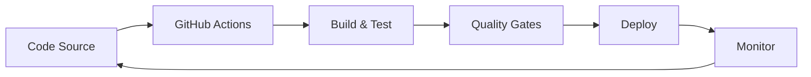

# 21. Extensions et écosystème C#

🔝 Retour au [Sommaire](/SOMMAIRE.md)


## Introduction

> *"Un bon développeur connaît ses outils. Un excellent développeur connaît l'écosystème."*

C# ne se limite pas au langage et au framework de base. C'est un **écosystème vivant** composé de milliers de bibliothèques, d'outils sophistiqués et de pratiques éprouvées qui transforment le développement quotidien. Ce chapitre vous guide dans cette jungle technologique pour devenir un développeur .NET complet et productif.

## 🌟 Pourquoi Maîtriser l'Écosystème ?

### L'Impact sur Votre Productivité

**❌ Sans écosystème** : Réinventer la roue à chaque projet
- Développement lent et laborieux
- Bugs dans le code fait maison
- Maintenance complexe
- Solutions non optimisées

**✅ Avec écosystème** : Tirer parti de l'expertise collective
- Développement accéléré (gains de 50-80%)
- Solutions robustes et testées
- Maintenance simplifiée
- Bonnes pratiques intégrées

### Évolution de l'Écosystème .NET

| Période | Caractéristiques | Impact |
|---------|------------------|--------|
| **2000-2010** | Écosystème fermé Microsoft | Solutions propriétaires limitées |
| **2010-2016** | Ouverture progressive | NuGet, premiers frameworks tiers |
| **2016-aujourd'hui** | Open Source & Cloud | Explosion de l'innovation |
| **Futur** | IA & Cross-platform | Ubiquité technologique |

## 🗺️ Cartographie de l'Écosystème

### 📚 Bibliothèques Essentielles
*Les incontournables pour tout développeur C#*

| Domaine | Bibliothèque | Utilité | Popularité |
|---------|-------------|---------|------------|
| **JSON** | Newtonsoft.Json / System.Text.Json | Sérialisation moderne | ⭐⭐⭐⭐⭐ |
| **Mapping** | AutoMapper | Transformation d'objets | ⭐⭐⭐⭐⭐ |
| **Validation** | FluentValidation | Règles métier expressives | ⭐⭐⭐⭐ |
| **Architecture** | MediatR | Pattern Mediator | ⭐⭐⭐⭐ |
| **Logging** | Serilog / NLog | Journalisation avancée | ⭐⭐⭐⭐⭐ |
| **Testing** | xUnit / NUnit | Tests automatisés | ⭐⭐⭐⭐⭐ |
| **ORM** | Entity Framework / Dapper | Accès aux données | ⭐⭐⭐⭐⭐ |

### 🛠️ Outils DevOps Modernes
*Automatisation et qualité continue*



**Pipeline Type** :
1. **Code** → Push sur repository
2. **CI** → Tests automatiques + build
3. **Quality** → Analyse statique + sécurité
4. **CD** → Déploiement automatisé
5. **Monitor** → Observabilité en production

### 🚀 Technologies Émergentes
*L'avenir du développement C#*

| Technologie | Maturité | Impact | Cas d'usage |
|-------------|----------|--------|-------------|
| **Blazor WebAssembly** | 🟢 Stable | Révolutionnaire | SPAs en C# |
| **Source Generators** | 🟡 En développement | Transformateur | Méta-programmation |
| **ML.NET** | 🟢 Stable | Innovant | IA intégrée |
| **MAUI** | 🟡 Évolutif | Prometteur | Apps multi-plateformes |
| **Minimal APIs** | 🟢 Stable | Simplifiant | Microservices rapides |

## 📖 Structure du Chapitre

### 🏗️ Partie 1 : Bibliothèques Fondamentales

**21.1 Bibliothèques et Frameworks Populaires**
- **JSON** : Newtonsoft.Json vs System.Text.Json
- **Mapping** : AutoMapper pour la transformation d'objets
- **Validation** : FluentValidation pour des règles expressives
- **Architecture** : MediatR et le pattern Mediator
- **Logging** : Serilog pour l'observabilité

```csharp
// Exemple : Validation fluide avec FluentValidation
public class UserValidator : AbstractValidator<User>
{
    public UserValidator()
    {
        RuleFor(x => x.Email)
            .NotEmpty().WithMessage("L'email est requis")
            .EmailAddress().WithMessage("Format d'email invalide");

        RuleFor(x => x.Age)
            .InclusiveBetween(18, 120)
            .WithMessage("L'âge doit être entre 18 et 120 ans");
    }
}
```

### ⚙️ Partie 2 : DevOps et Automatisation

**21.2 DevOps et Intégration Continue**
- **CI/CD** : Pipelines avec GitHub Actions et Azure DevOps
- **Tests** : Intégration dans les workflows automatisés
- **Déploiement** : Strategies multi-environnements
- **IaC** : Infrastructure as Code
- **Monitoring** : Observabilité en production

```yaml
# Exemple : Pipeline GitHub Actions
name: CI/CD Pipeline
on: [push, pull_request]
jobs:
  build-and-test:
    runs-on: ubuntu-latest
    steps:
    - uses: actions/checkout@v3
    - name: Setup .NET
      uses: actions/setup-dotnet@v3
      with:
        dotnet-version: '8.0.x'
    - name: Build
      run: dotnet build
    - name: Test
      run: dotnet test --logger trx --results-directory "TestResults"
```

### 🔮 Partie 3 : Tendances et Futur

**21.3 Tendances et Évolutions Futures**
- **Évolutions du langage** : C# 12, 13 et au-delà
- **Source Generators** : Méta-programmation moderne
- **Blazor** : C# côté client avec WebAssembly
- **ML.NET** : Intelligence artificielle intégrée
- **Cross-platform** : .NET partout

```csharp
// Exemple : Source Generator (C# 12+)
[AutoNotify]
public partial class UserViewModel
{
    private string _name; // Génère automatiquement Name property avec INotifyPropertyChanged
    private int _age;     // Génère automatiquement Age property avec INotifyPropertyChanged
}
```

## 🎯 Compétences Développées

### Techniques
- **Sélection** : Choisir les bonnes bibliothèques
- **Intégration** : Combiner plusieurs technologies
- **Performance** : Optimiser avec les bons outils
- **Sécurité** : Gérer les dépendances en sécurité
- **Monitoring** : Observer et diagnostiquer

### Méthodologiques
- **Évaluation** : Analyser la qualité des bibliothèques
- **Veille** : Suivre les évolutions de l'écosystème
- **Documentation** : Maîtriser les ressources communautaires
- **Contribution** : Participer à l'open source
- **Architecture** : Concevoir avec l'écosystème

## 🧭 Guide de Navigation

### Comment Choisir une Bibliothèque ?

**Critères d'Évaluation** :
1. **Popularité** : Stars GitHub, téléchargements NuGet
2. **Maintenance** : Fréquence des mises à jour
3. **Documentation** : Qualité et exhaustivité
4. **Communauté** : Support et contributions
5. **Compatibilité** : Support .NET Framework / Core
6. **Performance** : Benchmarks et optimisations
7. **Sécurité** : Historique des vulnérabilités

### Gestion des Dépendances

```xml
<!-- Bonnes pratiques dans .csproj -->
<Project Sdk="Microsoft.NET.Sdk">
  <PropertyGroup>
    <TargetFramework>net8.0</TargetFramework>
    <!-- Audit de sécurité automatique -->
    <NuGetAudit>true</NuGetAudit>
  </PropertyGroup>

  <PackageReference Include="Newtonsoft.Json" Version="13.0.3" />
  <PackageReference Include="Serilog" Version="3.1.1" />
  <!-- Version exacte pour la reproductibilité -->
</Project>
```

## 🚀 Roadmap d'Apprentissage

### Phase 1 : Fondamentaux (2-3 semaines)
- Maîtriser JSON (System.Text.Json)
- Découvrir AutoMapper
- Implémenter Serilog

### Phase 2 : Architecture (3-4 semaines)
- Pattern Mediator avec MediatR
- Validation avec FluentValidation
- Tests avec xUnit

### Phase 3 : DevOps (4-6 semaines)
- Pipelines CI/CD
- Déploiement automatisé
- Monitoring en production

### Phase 4 : Innovation (En continu)
- Source Generators
- Blazor WebAssembly
- ML.NET

## 💡 Conseils Pratiques

### Do's ✅
- **Commencer petit** : Une bibliothèque à la fois
- **Lire la documentation** : Comprendre avant d'implémenter
- **Tester en isolation** : Valider avant d'intégrer
- **Suivre les conventions** : Respecter les patterns établis
- **Contribuer** : Signaler les bugs, proposer des améliorations

### Don'ts ❌
- **Syndrome du marteau** : Pas de sur-ingénierie
- **Dépendances excessives** : Garder la simplicité
- **Versions bêta en production** : Privilégier la stabilité
- **Ignorer les licences** : Vérifier la compatibilité légale
- **Oublier la maintenance** : Planifier les mises à jour

## 🎓 Objectifs d'Apprentissage

À l'issue de ce chapitre, vous serez capable de :

1. **Naviguer** efficacement dans l'écosystème .NET
2. **Évaluer** et sélectionner les bibliothèques appropriées
3. **Intégrer** des solutions tierces dans vos projets
4. **Automatiser** vos workflows de développement
5. **Anticiper** les évolutions technologiques
6. **Contribuer** à la communauté open source

## 🌍 Impact sur Votre Carrière

La maîtrise de l'écosystème vous distingue en :
- **Productivité** : Livraison plus rapide et qualitative
- **Innovation** : Adoption des dernières technologies
- **Leadership** : Conseil et mentoring d'équipes
- **Résolution** : Solutions créatives aux défis complexes
- **Évolution** : Adaptation aux changements technologiques

---

*"Dans l'écosystème .NET, nous ne sommes pas des développeurs isolés, mais les membres d'une communauté mondiale qui construit l'avenir du développement logiciel."*

⏭️ 21.1. [Bibliothèques et frameworks populaires](/21-extensions-et-ecosysteme-csharp/21-1-bibliotheques-et-frameworks-populaires.md)
