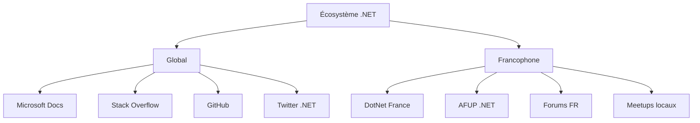

# 22. Ressources et communauté

🔝 Retour au [Sommaire](/SOMMAIRE.md)


## Introduction

> *"Si tu veux aller vite, va seul. Si tu veux aller loin, va avec les autres."* - Proverbe africain

Le développement C# ne s'arrête jamais. Les technologies évoluent, les bonnes pratiques se raffinent, et de nouvelles opportunités émergent constamment. Dans ce contexte, **votre réseau et vos ressources** deviennent aussi importants que vos compétences techniques. Ce chapitre vous guide pour devenir un membre actif de l'écosystème .NET et construire un parcours d'apprentissage continu.

## 🌟 Pourquoi la Communauté est Cruciale ?

### L'Évolution Constante de .NET

**En 2024, en 1 an :**
- 🔄 **4 versions mineures** de .NET 8
- 📚 **500+ nouvelles bibliothèques** populaires sur NuGet
- 🎯 **50+ nouvelles fonctionnalités** majeures C#
- 🌍 **100+ conférences** .NET dans le monde

**Sans communauté** : Rester à la traîne et manquer les innovations
**Avec communauté** : Anticiper, apprendre et contribuer aux évolutions

### Impact sur Votre Carrière

| Bénéfice | Sans Réseau | Avec Réseau Actif |
|----------|-------------|-------------------|
| **Apprentissage** | Auto-formation lente | Mentorat et partage rapide |
| **Opportunités** | Candidatures à l'aveugle | Recommandations et offres directes |
| **Résolution problèmes** | Seul face aux bugs | Support communautaire |
| **Innovation** | Suiveur de tendances | Acteur du changement |
| **Visibilité** | Anonyme | Reconnaissance expertise |

## 🗺️ Cartographie de l'Écosystème .NET

### 🎯 Ressources par Objectif

| Objectif | Ressources Clés | Format | Niveau |
|----------|----------------|--------|--------|
| **Apprendre** | Microsoft Learn, Pluralsight | Cours, labs | Tous |
| **Résoudre** | Stack Overflow, GitHub Issues | Q&A, communauté | Tous |
| **Suivre l'actualité** | Blogs .NET, podcasts | Articles, audio | Intermédiaire+ |
| **Réseauter** | Conférences, meetups | Événements | Tous |
| **Contribuer** | Open Source, documentation | Code, écriture | Avancé |
| **Se certifier** | Microsoft Certifications | Examens | Tous |

### 🌍 Communauté Mondiale vs Locale



## 📚 Structure du Chapitre

### 📖 22.1 Documentation Officielle
*Votre référence de base*

**Microsoft Learn** - Plateforme d'apprentissage moderne
- Parcours structurés par rôle (développeur, architecte, etc.)
- Labs pratiques avec environnements sandbox
- Badges et certifications intégrées
- Contenu maintenu par les équipes produit

**Docs.Microsoft.com** - Référence technique exhaustive
- API documentation complète
- Guides d'architecture
- Tutorials étape par étape
- Exemples de code téléchargeables

```csharp
// Exemple : Code directement dans la documentation
var builder = WebApplication.CreateBuilder(args);
var app = builder.Build();

app.MapGet("/", () => "Hello World!");
app.Run();
```

### 🌐 22.2 Communautés en Ligne
*Votre réseau de support et d'apprentissage*

**Plateformes Internationales**
- **Stack Overflow** (30M+ questions .NET)
- **GitHub** (500K+ projets C#)
- **Reddit** (r/csharp, r/dotnet)
- **Discord/Slack** (dev communities)

**Communautés Francophones**
- **DotNet France** (5K+ membres)
- **Microsoft Tech Community France**
- **LinkedIn Groupes .NET FR**
- **Forums spécialisés**

**Comment Participer Efficacement** :
1. **Observer** avant de poster
2. **Poser des questions précises** avec code reproduisible
3. **Répondre** quand vous pouvez aider
4. **Partager** vos découvertes et projets
5. **Rester respectueux** et constructif

### 🎤 22.3 Conférences et Événements
*Accélérateurs d'apprentissage et de réseau*

**Événements Majeurs 2024**

| Événement | Type | Audience | Date Typique |
|-----------|------|----------|--------------|
| **Microsoft Build** | Hybride | 10K+ | Mai |
| **.NET Conf** | Virtuel | 50K+ | Novembre |
| **NDC Oslo/London** | Présentiel | 2K+ | Juin/Janvier |
| **DevSum Stockholm** | Présentiel | 1K+ | Mai |
| **TechDays France** | Hybride | 5K+ | Octobre |

**Événements Locaux**
- **Meetups .NET** (toutes grandes villes)
- **User Groups Microsoft**
- **Coding dojos**
- **Hackathons**

**Maximiser Votre Participation** :
- ✅ Préparer vos questions à l'avance
- ✅ Prendre des notes structurées
- ✅ Connecter avec les speakers sur LinkedIn
- ✅ Partager vos apprentissages après l'événement
- ✅ Proposer des présentations pour l'année suivante

### 🎓 22.4 Formation Continue et Certifications
*Structurer votre montée en compétences*

**Certifications Microsoft 2024**

| Certification | Niveau | Domaine | Validité |
|---------------|--------|---------|----------|
| **AZ-204** | Associate | Azure Developer | 3 ans |
| **AZ-400** | Expert | DevOps Engineer | 3 ans |
| **PL-300** | Associate | Power BI Data Analyst | 3 ans |
| **SC-100** | Expert | Cybersecurity Architect | 3 ans |

**Plateformes d'Apprentissage**

| Plateforme | Prix | Forces | Public |
|------------|------|--------|--------|
| **Microsoft Learn** | Gratuit | Officiel, à jour | Tous |
| **Pluralsight** | $29/mois | Complet, qualité | Pro/Entreprise |
| **LinkedIn Learning** | $20/mois | Business skills | Managers/Seniors |
| **Udemy** | $10-200/cours | Varié, pratique | Autodidactes |

### 📝 22.5 Blogs et Podcasts
*Votre veille technologique quotidienne*

**Blogs Incontournables**

| Blog | Auteur | Spécialité | Fréquence |
|------|--------|------------|-----------|
| **The .NET Blog** | Microsoft | Officiel | Hebdomadaire |
| **Scott Hanselman** | Scott Hanselman | Leadership Tech | Bi-hebdomadaire |
| **Jon Skeet** | Jon Skeet | C# Expert | Irrégulier |
| **Andrew Lock** | Andrew Lock | ASP.NET Core | Hebdomadaire |

**Podcasts Essentiels**
- **.NET Rocks!** (2x/semaine) - Interviews et techniques
- **Coding Blocks** (Hebdomadaire) - Bonnes pratiques
- **The Changelog** (Hebdomadaire) - Open source
- **Developpez.com Podcast** (Français)

### 🤝 22.6 Contribution Open Source
*Donnez et recevez de la communauté*

**Niveaux de Contribution**

1. **👶 Débutant** : Signaler des bugs, améliorer documentation
2. **🏃 Intermédiaire** : Corriger des bugs simples, ajouter tests
3. **🦅 Avancé** : Nouvelles fonctionnalités, review de code
4. **🎯 Expert** : Maintenir des projets, mentorat

**Projets .NET pour Commencer**
- **Documentation .NET** (github.com/dotnet/docs)
- **ASP.NET Core** (github.com/dotnet/aspnetcore)
- **Entity Framework** (github.com/dotnet/efcore)
- **Bibliotheques communautaires** (AutoMapper, Serilog...)

## 🎯 Roadmap d'Engagement Communautaire

### Phase 1 : Observer et Apprendre (0-3 mois)
- ✅ S'inscrire aux ressources essentielles
- ✅ Suivre les blogs et podcasts clés
- ✅ Rejoindre 2-3 communautés en ligne
- ✅ Assister à 1 meetup local

### Phase 2 : Participer Activement (3-6 mois)
- ✅ Poser et répondre à des questions
- ✅ Partager vos projets et découvertes
- ✅ Contribuer à la documentation
- ✅ Présenter dans un meetup local

### Phase 3 : Contribuer et Leader (6+ mois)
- ✅ Maintenir un projet open source
- ✅ Écrire des articles techniques
- ✅ Mentorer d'autres développeurs
- ✅ Organiser des événements

## 💡 Stratégies Pratiques

### 🎯 Construire Votre Présence

**Sur GitHub** :
```markdown
# Votre profil README.md
## 👋 Salut, je suis [Votre Nom]

🔭 Je travaille actuellement sur [projet actuel]
🌱 J'apprends [nouvelles technologies]
💬 Demandez-moi des questions sur [vos spécialités]
📫 Comment me contacter: [email/linkedin]
⚡ Fun fact: [quelque chose d'intéressant]
```

**Sur LinkedIn** :
- Partager 1 article/semaine sur vos apprentissages
- Commenter les posts de leaders .NET
- Publier vos projets avec screenshots
- Célébrer vos certifications et achievements

### 🤝 Réseautage Efficace

**En Ligne** :
- Utiliser des hashtags pertinents (#dotnet, #csharp, #aspnetcore)
- Remercier publiquement ceux qui vous aident
- Offrir de l'aide avant d'en demander
- Partager le travail d'autres développeurs

**En Présentiel** :
- Préparer un elevator pitch de 30 secondes
- Poser des questions aux speakers après leurs talks
- Échanger des cartes de visite ou contacts LinkedIn
- Suivre dans les 48h avec un message personnalisé

## 🏆 Mesurer Votre Progrès

### KPIs Personnels
- **Réseau** : +10 connexions qualifiées/mois
- **Apprentissage** : 1 nouvelle compétence/trimestre
- **Contribution** : 1 PR/mois sur des projets open source
- **Visibilité** : 1 article ou présentation/trimestre
- **Certifications** : 1-2 par an selon vos objectifs

### Outils de Suivi
- **GitHub Profile** : Contributions publiques
- **LinkedIn Analytics** : Portée de vos posts
- **Blog Analytics** : Lectures et engagement
- **Feedback communautaire** : Commentaires et réactions

## 🌟 Bénéfices Long Terme

### Impact Professionnel
- **Opportunités cachées** : 80% des offres ne sont jamais publiées
- **Négociation salariale** : Reconnaissance = pouvoir de négociation
- **Évolution de carrière** : Visibilité = promotions et leadership
- **Sécurité d'emploi** : Réseau = filet de sécurité

### Impact Personnel
- **Apprentissage accéléré** : Mentorat et partage
- **Confiance technique** : Validation par les pairs
- **Accomplissement** : Aider d'autres développeurs
- **Perspective globale** : Vision au-delà de votre entreprise

---

*"La meilleure façon de prédire l'avenir, c'est de le créer. Dans l'écosystème .NET, nous le créons ensemble."*

⏭️ 22.1. [Documentation officielle](/22-ressources-et-communaute/22-1-documentation-officielle.md)
